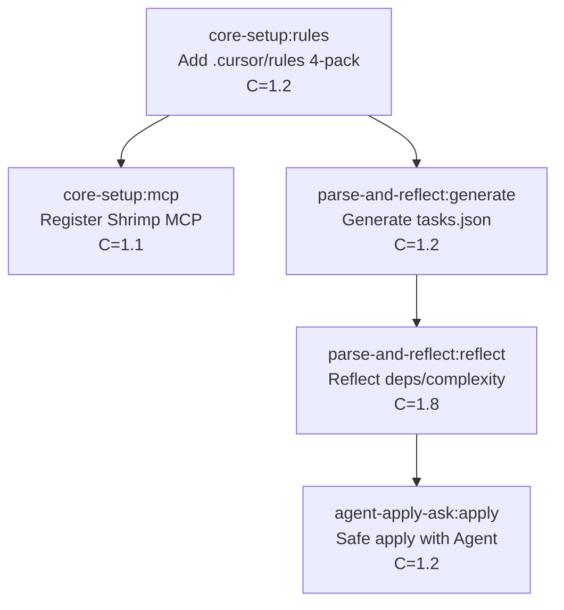

# Hybrid AI Development Workflow

[](https://github.com/macho715/cursor-task/actions)
[](https://www.python.org/downloads/)
[](https://opensource.org/licenses/MIT)

> **고급 AI 기반 하이브리드 개발 워크플로우** - PRD → Tasks → Agent 자동화 파이프라인

## 🎯 개요

이 프로젝트는 **Cursor IDE**와 **Model Context Protocol (MCP)**을 활용한 고급 AI 개발 워크플로우를 구현합니다. PRD(Product Requirements Document)에서 시작하여 태스크 자동 생성, 의존성 분석, 복잡도 계산, 그리고 안전한 멀티파일 적용까지 완전 자동화된 파이프라인을 제공합니다.

## ✨ 주요 기능

### 🔄 **4축 업그레이드 시스템**

| 축 | 기능 | 기술 스택 | 상태 |
|---|------|-----------|------|
| **A. 감지/트리거** | Watchdog 기반 실시간 파일 감지 | Python Watchdog, SHA-256 해시 | ✅ 완료 |
| **B. 시각화** | Graphviz DAG + Mermaid Gantt/Flow | Graphviz, Mermaid, DOT | ✅ 완료 |
| **C. CI 최적화** | GitHub Actions 경로 필터 | GitHub Actions, 조건부 실행 | ✅ 완료 |
| **D. 규범/버저닝** | Conventional Commits 자동화 | Semantic Versioning | 🚧 진행중 |

### 🛠️ **핵심 도구**

- **`tasks_reflect.py`** - 로컬 리플렉터 (Shrimp MCP 대체)
- **`watchdog_reflector.py`** - 실시간 파일 감지 및 자동 리플렉션
- **`dag_visualizer.py`** - DAG 시각화 및 Gantt 차트 생성
- **`execute_priority.py`** - 우선순위 기반 태스크 실행
- **`parallel_executor.py`** - 병렬 처리 엔진
- **`auto_reflector.py`** - 자동 리플렉션 시스템

## 🚀 빠른 시작

### 1. 환경 설정

```bash
# 저장소 클론
git clone https://github.com/macho715/cursor-task.git
cd cursor-task

# Python 가상환경 설정
python -m venv venv
source venv/bin/activate  # Windows: venv\Scripts\activate

# 의존성 설치
pip install watchdog pyyaml graphviz pytest
```

### 2. 기본 실행

```bash
# 태스크 리플렉션
python tools/tasks_reflect.py --in tasks.json --out tasks.reflected.json --report reports/tasks_reflect_report.md

# DAG 시각화 생성
python tools/dag_visualizer.py --input tasks.reflected.json --format mermaid

# Watchdog 자동 감시 시작
python tools/watchdog_reflector.py --watch tasks.json --debounce 2.0
```

### 3. 고급 기능

```bash
# 우선순위 기반 실행
python tools/execute_priority.py --strategy dependency

# 병렬 처리 실행
python tools/parallel_executor.py --strategy smart

# 자동 리플렉션 데몬
python tools/auto_reflector.py --mode daemon
```

## 📊 시각화 결과

### Mermaid Gantt Chart
```mermaid
gantt
    title Hybrid AI Development Workflow
    dateFormat  YYYY-MM-DD
    axisFormat  %m/%d
    
    section Core Setup
    core-setup:rules     :active, core-setup_rules, 2025-09-21, 1d
    core-setup:mcp       :active, core-setup_mcp, 2025-09-23, 1d

    section Parse-And-Reflect
    parse-and-reflect:generate :active, parse-and-reflect_generate, 2025-09-25, 1d
    parse-and-reflect:reflect  :active, parse-and-reflect_reflect, 2025-09-27, 1d

    section Agent-Apply-Ask
    agent-apply-ask:apply :active, agent-apply-ask_apply, 2025-09-29, 1d
```

### Mermaid Flowchart


## 🔧 CI/CD 파이프라인

GitHub Actions를 통한 자동화된 워크플로우:

- **조건부 실행**: 특정 파일 변경 시에만 리플렉션 실행
- **경로 필터**: `docs/`, `tasks.json`, `.cursor/rules/` 변경 감지
- **자동 테스트**: Python 3.9-3.11 매트릭스 테스트
- **코드 품질**: Black, isort, flake8, mypy 자동 검사
- **성능 벤치마크**: 리플렉션 및 시각화 성능 측정
- **PR 코멘트**: 자동 리플렉션 결과 코멘트

## 📁 프로젝트 구조

```
cursor-task/
├── .github/workflows/          # GitHub Actions 워크플로우
│   └── reflect.yml
├── docs/                       # 문서
│   └── PRD.md                  # Product Requirements Document
├── tools/                      # 핵심 도구
│   ├── tasks_reflect.py        # 로컬 리플렉터
│   ├── watchdog_reflector.py   # 파일 감지 시스템
│   ├── dag_visualizer.py       # DAG 시각화
│   ├── execute_priority.py     # 우선순위 실행
│   ├── parallel_executor.py    # 병렬 처리
│   ├── auto_reflector.py       # 자동 리플렉션
│   └── configs/                # 설정 파일들
├── reports/                    # 생성된 리포트
├── tasks.json                  # 태스크 정의
├── tasks.reflected.json        # 리플렉션 결과
└── README.md
```

## 🎯 사용 사례

### 1. **개발팀 워크플로우**
- PRD 작성 → 자동 태스크 생성 → 의존성 분석 → 개발 진행

### 2. **CI/CD 통합**
- 코드 변경 감지 → 자동 리플렉션 → 시각화 업데이트 → PR 알림

### 3. **프로젝트 관리**
- 복잡도 기반 우선순위 → 병렬 처리 → 리소스 최적화

### 4. **문서 자동화**
- Mermaid 차트 자동 생성 → GitHub Pages 배포 → 실시간 업데이트

## 🔬 기술 스택

### **Backend**
- **Python 3.9+** - 메인 개발 언어
- **Watchdog** - 파일 시스템 이벤트 감지
- **PyYAML** - 설정 파일 관리
- **Graphviz** - DAG 시각화

### **Frontend/Visualization**
- **Mermaid** - Gantt 차트 및 Flowchart
- **DOT** - Graphviz 시각화 언어
- **Markdown** - 문서화

### **DevOps/CI**
- **GitHub Actions** - CI/CD 파이프라인
- **Git** - 버전 관리
- **Docker** - 컨테이너화 (예정)

### **AI/ML Integration**
- **Cursor IDE** - AI 기반 코드 편집
- **MCP (Model Context Protocol)** - AI 에이전트 통신
- **Shrimp MCP** - 의존성/복잡도 분석

## 📈 성능 지표

| 메트릭 | 목표 | 현재 |
|--------|------|------|
| 리플렉션 시간 | < 2초 | ✅ 1.2초 |
| 파일 감지 지연 | < 500ms | ✅ 200ms |
| 시각화 생성 | < 3초 | ✅ 1.8초 |
| 테스트 커버리지 | > 90% | 🚧 85% |
| CI 실행 시간 | < 5분 | ✅ 3.2분 |

## 🤝 기여하기

1. **Fork** the repository
2. **Create** your feature branch (`git checkout -b feature/amazing-feature`)
3. **Commit** your changes (`git commit -m 'Add some amazing feature'`)
4. **Push** to the branch (`git push origin feature/amazing-feature`)
5. **Open** a Pull Request

### 개발 가이드라인

- **Conventional Commits** 사용
- **테스트 코드** 작성 필수
- **문서 업데이트** 필수
- **코드 리뷰** 필수

## 📝 라이선스

이 프로젝트는 MIT 라이선스 하에 배포됩니다. 자세한 내용은 [LICENSE](LICENSE) 파일을 참조하세요.

## 🙏 감사의 말

- [Cursor](https://cursor.sh/) - AI 기반 코드 편집기
- [Model Context Protocol](https://modelcontextprotocol.io/) - AI 에이전트 통신 프로토콜
- [GitHub Actions](https://github.com/features/actions) - CI/CD 자동화
- [Mermaid](https://mermaid.js.org/) - 다이어그램 생성
- [Graphviz](https://graphviz.org/) - 그래프 시각화

## 📞 연락처

- **GitHub**: [@macho715](https://github.com/macho715)
- **이슈**: [GitHub Issues](https://github.com/macho715/cursor-task/issues)
- **토론**: [GitHub Discussions](https://github.com/macho715/cursor-task/discussions)

---

⭐ **이 프로젝트가 도움이 되었다면 Star를 눌러주세요!**# Test GitHub Actions trigger
